# 10장 분산 시스템에서의 일관성과 원자성

메일 발송과 장바구니 예제를 중심으로, 이전 설계가 왜 부족했고 어떤 tradeoff를 받아들이며 개선했는지를 

설계 변화를 위주로 설명합니다.

- `retry`, `idempotency`, `deduplication`, `upsert`

---

## 전체 흐름

| 순서 | 예제 | 부족했던 설계 | 다음 개선 |
|---:|---|---|---|
| 1 | 메일 발송 | 네트워크 실패를 단순 실패로 해석한다. | 결과를 모르는 상태로 보고 retry를 고려한다. |
| 2 | 메일 발송 | retry만 추가한다. | side effect 중복을 막기 위해 멱등성/중복 제거를 설계한다. |
| 3 | 장바구니 | delta 이벤트를 누적 적용한다. | full-state 이벤트로 멱등 친화적인 모델을 만든다. |
| 4 | 장바구니 | full-state만 믿는다. | 파티션별 순서나 version으로 오래된 이벤트를 막는다. |
| 5 | 메일 발송 | find-action-save dedup을 사용한다. | atomic insert-if-absent/upsert로 race window를 줄인다. |

---

## 1. 메일 발송: 실패 응답은 처리 실패가 아니다

**발표 흐름**

먼저 가장 단순한 메일 발송 예제를 보겠습니다. Application A가 Mail Service를 호출합니다.

여기서 Mail Service 자체가 실패하면 단순해 보입니다. 하지만 더 어려운 상황은 메일은 실제로 발송됐는데 응답만 네트워크에서 유실되는 경우입니다.

호출자는 timeout만 보게 되고, 메일이 갔는지 안 갔는지 판단할 수 없습니다.

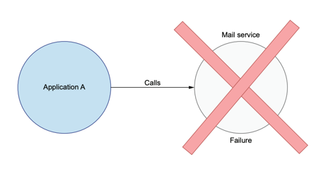

**부족한 설계**

timeout을 “처리 실패”로 해석합니다. 이 설계는 호출자의 관찰과 실제 처리 결과가 다를 수 있다는 사실을 놓칩니다.

**문제**

메일 발송, 결제, 이벤트 저장처럼 side effect가 있는 작업에서는 결과를 모르는 상태가 곧 정합성 리스크가 됩니다.

**다음 개선**

실패를 “결과 불명”으로 다루고 retry를 도입합니다. 하지만 retry는 곧 중복 실행 문제를 만듭니다.

**한 줄 요약:** 분산 시스템에서 timeout은 실패 확정이 아니라 결과 불명 상태입니다.

---

## 2. 메일 발송: retry는 가용성을 높이지만 중복을 만든다

**발표 흐름**

결과를 모르니 자연스럽게 retry를 생각하게 됩니다.

retry는 일시적인 네트워크 장애를 복구하는 좋은 방법입니다. 그런데 첫 요청에서 메일이 이미 발송됐고 응답만 유실됐다면, retry는 같은 메일을 다시 보냅니다.

이때 시스템은 at-least-once 동작을 하게 됩니다. 적어도 한 번은 처리되지만, 한 번만 처리된다는 보장은 없습니다.

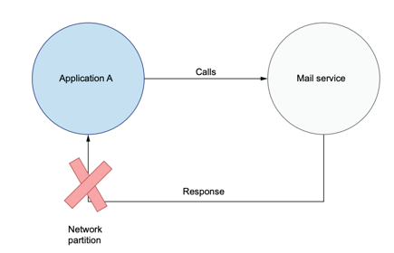
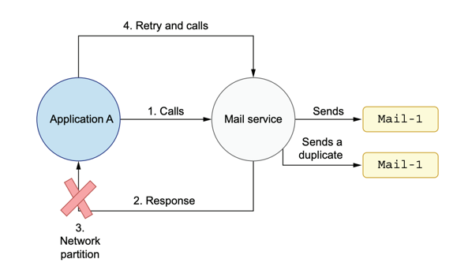

**부족한 설계**

retry만 추가합니다. 이 설계는 장애 복구에는 도움이 되지만, side effect가 중복될 수 있다는 점을 통제하지 않습니다.

**tradeoff**

retry를 포기하면 장애 때마다 수동 복구가 필요합니다. retry를 쓰면 자동 복구가 가능하지만 중복을 감당해야 합니다.

**다음 개선**

재시도해도 결과가 같도록 작업을 멱등적으로 만들거나, 중복 실행을 식별할 request identity를 도입합니다.

**한 줄 요약:** retry는 신뢰성을 높이는 동시에 중복 실행이라는 새 요구사항을 만듭니다.

---

## 3. 장바구니: delta 이벤트는 중복 전달에 약하다

**발표 흐름**

이제 장바구니 예제로 넘어가겠습니다.

사용자가 책 A를 장바구니에 두 번 담으면, 단순한 이벤트 설계에서는 “책 A 1개 추가” 이벤트가 두 번 발행됩니다.

소비자는 이 이벤트를 누적해서 자기 read model을 만듭니다. 그런데 첫 번째 이벤트가 retry 때문에 한 번 더 전달되면 소비자는 수량을 3으로 계산할 수 있습니다.

 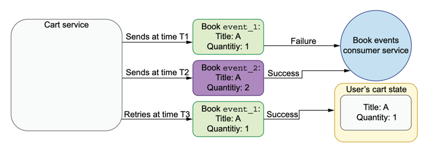
**부족한 설계**

이벤트를 “변경분”으로만 보냅니다. 이 설계는 이벤트가 정확히 한 번만 전달된다는 가정에 의존합니다.

**문제**

현실의 큐와 네트워크는 at-least-once 전달을 제공하는 경우가 많습니다. 중복 이벤트는 변경분을 다시 적용하게 만듭니다.

**다음 개선**

소비자가 누적 계산하지 않아도 되도록, 변경분 대신 현재 장바구니 상태를 담은 full-state 이벤트로 바꿉니다.

**한 줄 요약:** delta 이벤트는 중복 전달이 곧 중복 적용이 되기 때문에 retry와 잘 맞지 않습니다.

---

## 4. 장바구니: full-state 이벤트는 중복에 강하지만 순서가 필요하다

**발표 흐름**

개선안은 이벤트에 장바구니의 현재 상태를 담는 것입니다.

“책 A 1개 추가”가 아니라 “현재 책 A는 2개”라고 보내면, 같은 이벤트가 두 번 와도 상태는 그대로 2입니다.

하지만 새 문제가 있습니다. 오래된 상태가 retry로 늦게 도착하면 최신 상태를 덮어쓸 수 있습니다. 그래서 full-state만으로 끝나지 않고 순서 보장이 필요합니다.

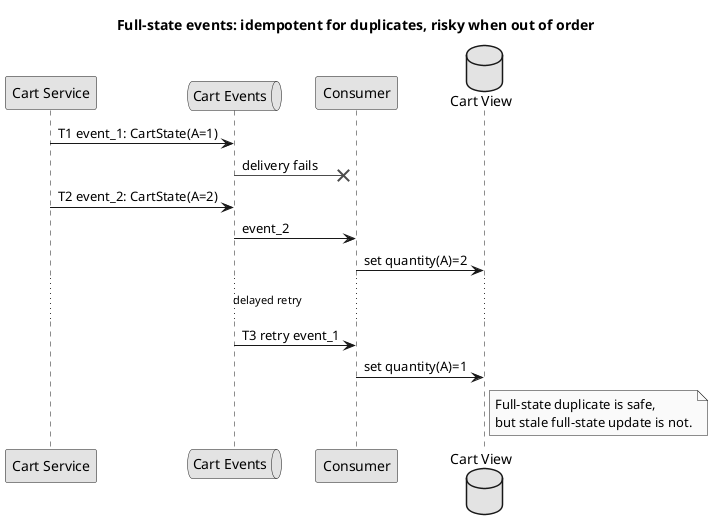

**개선된 점**

같은 full-state 이벤트가 중복 전달되어도 같은 값으로 덮어쓰기 때문에 delta 이벤트보다 멱등적입니다.

**부족한 점**

이전 상태가 늦게 도착하면 최신 상태를 되돌릴 수 있습니다. 중복 문제는 줄였지만 순서 문제는 남아 있습니다.

**다음 개선**

`user_id`를 파티션 키로 사용해 사용자별 순서를 보장하거나, `version`/`sequence`로 오래된 이벤트를 거부합니다.

**tradeoff**

full-state 이벤트는 payload가 커지고, 파티션별 순서 보장은 처리량과 병렬성 설계에 제약을 줍니다.

**한 줄 요약:** full-state 이벤트는 중복에는 강하지만, 최신성을 지키려면 순서나 버전이 필요합니다.

---

## 5. CQRS: read model이 늘어나면 중복과 순서 문제가 증폭된다

**발표 흐름**

장바구니 이벤트는 여러 소비자가 각자 다른 read model을 만들 때 더 중요해집니다.

사용자 프로필 서비스는 `user_id` 조회에 최적화된 DB를 만들고, 분석 서비스는 그래프나 파일 기반 분석 모델을 만들 수 있습니다.

장점은 확장성과 독립성입니다. 단점은 같은 이벤트 흐름의 중복과 순서 문제가 여러 저장소로 퍼진다는 점입니다.

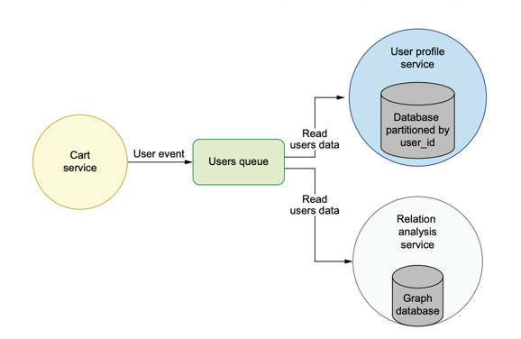

**개선된 점**

쓰기 모델과 읽기 모델을 분리해 각 서비스가 자기 조회 패턴에 맞게 데이터를 최적화할 수 있습니다.

**부족한 점**

데이터가 N곳에 복제되므로, 하나의 중복 이벤트나 순서 역전이 여러 read model의 divergence로 이어질 수 있습니다.

**다음 개선**

소비자 쪽 deduplication, 파티션별 ordering, version 기반 stale event 차단을 read model 설계의 일부로 포함합니다.

**한 줄 요약:** CQRS는 확장성을 얻는 대신 중복, 순서, 데이터 divergence를 명시적으로 설계해야 합니다.

---

## 6. 메일 발송: request ID 기반 deduplication 도입

**발표 흐름**

장바구니는 이벤트 형태를 바꿔 멱등성에 가까워질 수 있었습니다.

하지만 메일 발송은 이미 외부 side effect입니다. 그래서 request ID를 도입합니다.

Application A가 최초 요청에 UUID를 붙이고, retry할 때도 같은 UUID를 보냅니다. Mail Service는 이 ID를 영속 저장소에 기록해 이미 처리한 요청인지 판단합니다.

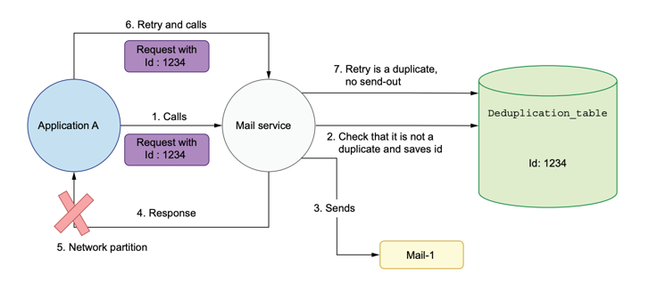

**개선된 점**

같은 비즈니스 요청을 식별할 수 있습니다. retry가 새 요청인지, 같은 요청의 반복인지 구분할 수 있습니다.

**부족한 점**

ID를 언제 저장하느냐가 어렵습니다. 처리 전에 저장하면 누락이 생길 수 있고, 처리 후에 저장하면 중복이 생길 수 있습니다.

**다음 개선**

먼저 “처리 전 저장” 방식이 왜 부족한지 보고, 그 다음 “처리 후 저장” 방식의 race condition을 봅니다.

**한 줄 요약:** deduplication의 시작은 retry마다 유지되는 안정적인 request ID입니다.

---

## 7. 메일 발송: 먼저 기록하면 중복은 줄지만 누락이 생긴다

**발표 흐름**

첫 번째 dedup 설계는 요청이 들어오면 ID를 먼저 저장하고 메일을 보내는 방식입니다.

이렇게 하면 retry가 들어와도 중복 발송은 잘 막습니다. 하지만 ID 저장 직후 실제 메일 발송이 실패하면 문제가 됩니다.

retry는 이미 처리된 요청으로 보이기 때문에 무시되고, 메일은 끝내 발송되지 않습니다.

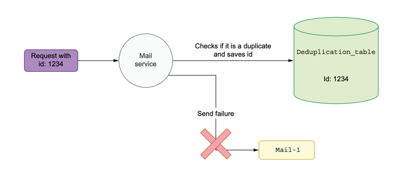

**개선된 점**

중복 발송 방어는 강합니다. ID가 먼저 기록되므로 같은 ID의 retry가 쉽게 차단됩니다.

**부족한 점**

비즈니스 action의 성공을 보장하지 못합니다. dedup table에는 성공처럼 남지만 실제 side effect는 실패할 수 있습니다.

**다음 개선**

메일 발송이 성공한 뒤 ID를 저장해 봅니다. 그러면 누락은 줄어들지만, 이번에는 동시성 문제가 생깁니다.

**한 줄 요약:** 처리 전 dedup 기록은 중복을 막지만 실패한 작업을 성공처럼 봉인할 수 있습니다.

---

## 8. 메일 발송: 처리 후 기록은 find-action-save race를 만든다

**발표 흐름**

다음 설계는 먼저 ID가 있는지 확인하고, 없으면 메일을 보낸 뒤, 성공하면 ID를 저장하는 방식입니다.

직관적으로는 좋아 보입니다. 실패하면 저장하지 않으니 retry가 가능하기 때문입니다.

하지만 find와 save 사이에 메일 발송이라는 긴 외부 호출이 들어갑니다. 이 사이에 retry가 끼어들면 두 요청 모두 중복이 아니라고 판단할 수 있습니다.

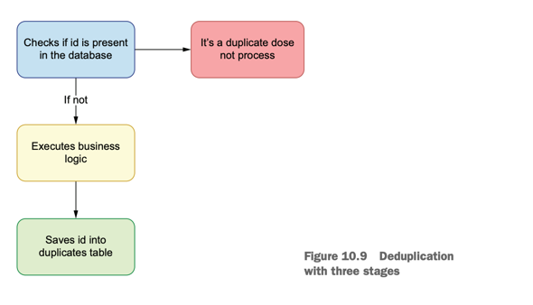

**개선된 점**

메일 발송이 실패하면 ID를 저장하지 않으므로 retry로 복구할 수 있습니다.

**부족한 점**

find, action, save가 서로 다른 단계입니다. 외부 호출이 길어질수록 retry가 끼어들 race window가 커집니다.

**다음 개선**

여러 노드 배포에서는 이 문제가 더 자연스럽게 발생합니다. 로드밸런서 뒤에서 같은 ID가 다른 인스턴스로 갈 수 있습니다.

**한 줄 요약:** 처리 후 기록 방식은 누락은 줄이지만 find와 save 사이의 틈에서 중복이 발생합니다.

---

## 9. 메일 발송: 여러 노드에서는 같은 race가 더 쉽게 발생한다

**발표 흐름**

실제 마이크로서비스는 보통 여러 인스턴스로 배포되고 로드밸런서 뒤에 있습니다.

첫 요청은 Mail #1로 가고, timeout 후 retry는 Mail #2로 갈 수 있습니다.

둘 다 같은 dedup table을 보더라도, 둘이 확인하는 시점에 아직 ID가 저장되어 있지 않으면 둘 다 메일을 보냅니다.

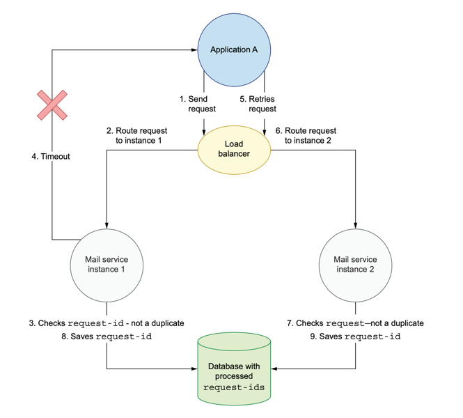

**개선된 점**

서비스 인스턴스를 stateless로 두고, 처리된 ID는 공유 저장소에 둡니다. 수평 확장에는 필요한 방향입니다.

**부족한 점**

공유 저장소를 쓴다는 사실만으로는 충분하지 않습니다. find와 save가 분리되어 있으면 여러 인스턴스가 동시에 “없다”고 판단할 수 있습니다.

**다음 개선**

중복 확인과 ID 저장을 하나의 원자적 저장소 연산으로 합칩니다.

**한 줄 요약:** 수평 확장 환경에서는 공유 상태보다 원자적 상태 변경이 더 중요합니다.

---

## 10. 최종 개선: find와 save를 atomic upsert로 합친다

**발표 흐름**

이제 핵심 개선입니다. 문제는 find와 save가 분리된 두 원격 호출이라는 점입니다.

그래서 확인과 기록을 데이터베이스가 한 번에 처리하게 만듭니다.

`insert-if-absent-and-return` 같은 연산을 사용하면, 두 요청이 동시에 와도 하나만 insert에 성공하고 다른 하나는 이미 존재한다고 판단합니다.

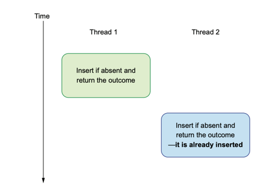

**개선된 점**

중복 판정과 기록 사이의 race window를 제거합니다. 중복 판정 로직의 원자성은 데이터베이스가 보장합니다.

**tradeoff**

deduplication은 “이 ID를 처음 봤는가”를 안전하게 판단할 뿐, 메일 발송의 end-to-end 성공까지 자동 보장하지는 않습니다.

**추가 설계**

실패 복구까지 필요하면 transaction log, 상태 머신, 보상 처리, 처리 상태 rollback 같은 별도 메커니즘을 함께 검토해야 합니다.

**한 줄 요약:** 원자성은 코드를 빠르게 실행해서 얻는 것이 아니라, 쪼개진 원격 연산을 하나의 저장소 연산으로 합쳐서 얻습니다.

---

## 발표 마무리: 설계 변화 중심 요약

| 설계 단계 | 좋아진 점 | 부족한 점 | 다음 판단 |
|---|---|---|---|
| retry 없음 | 중복 side effect는 적다. | 일시 장애마다 수동 복구가 필요하다. | retry를 넣되 중복을 전제로 설계한다. |
| retry만 추가 | 가용성이 좋아진다. | 메일/결제 같은 side effect가 중복될 수 있다. | 멱등성 또는 deduplication을 도입한다. |
| delta 이벤트 | payload가 작고 의미가 단순하다. | 중복 전달 시 read model이 깨진다. | 가능하면 full-state 이벤트로 바꾼다. |
| full-state 이벤트 | 중복 전달에는 강하다. | 순서 역전과 큰 payload 문제가 남는다. | partition ordering 또는 version 검증을 둔다. |
| naive dedup | request ID로 같은 요청을 식별한다. | find-action-save가 분리되어 race condition이 생긴다. | atomic upsert로 확인과 기록을 합친다. |

**최종 메시지**

분산 시스템의 설계는 “실패하지 않게 만들기”가 아니라, 실패와 재시도가 만들어내는 중복, 순서, 원자성 문제를 어디서 책임질지 정하는 일입니다.

---

Source basis: Tomasz Lelek, _Software Mistakes and Tradeoffs: How to make good programming decisions_, Chapter 10, pp.287-307.

